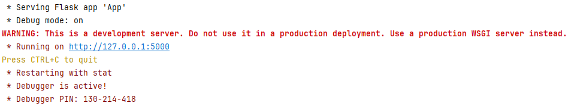
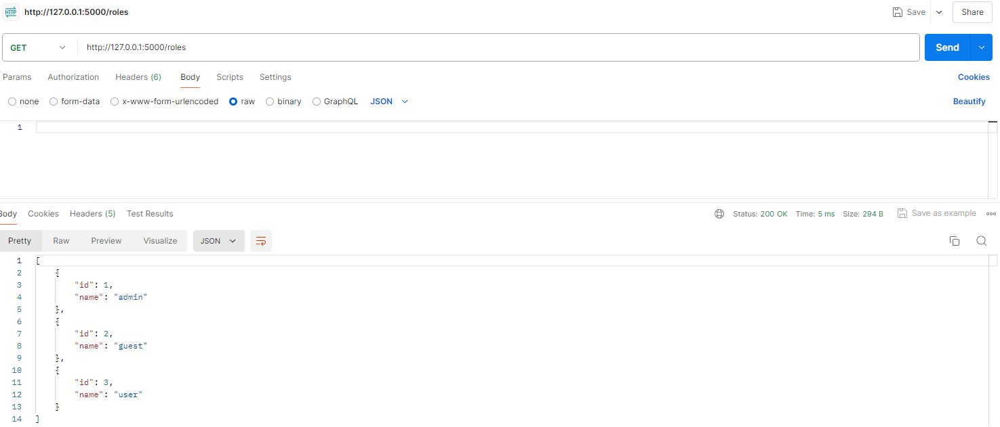
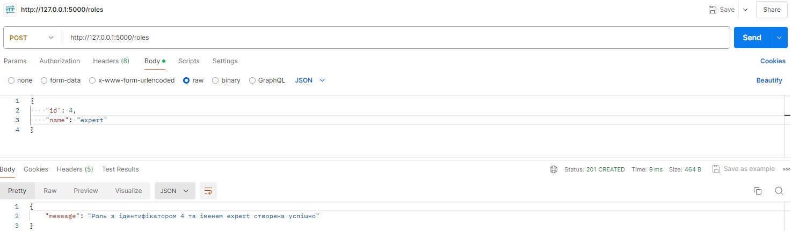
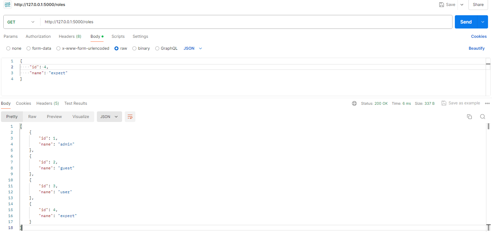
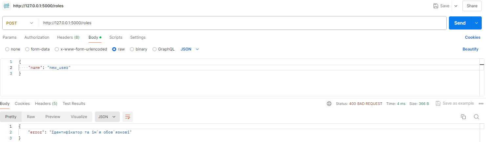
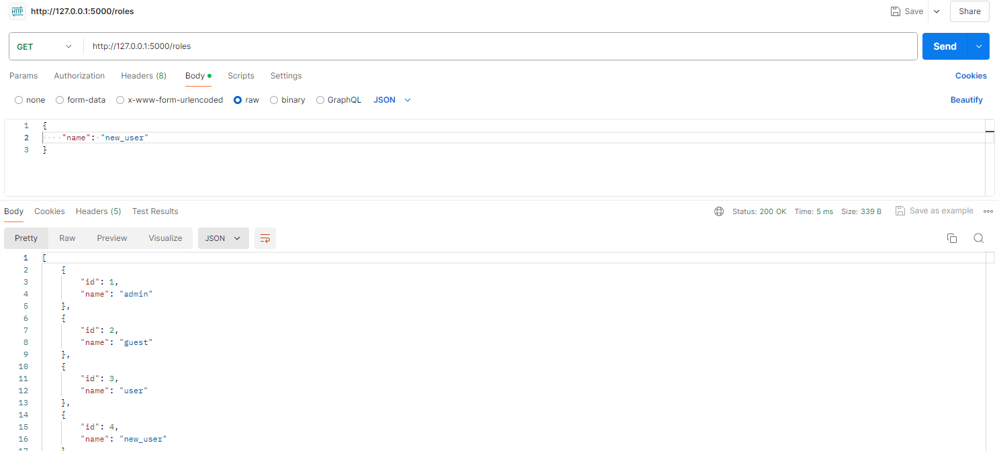
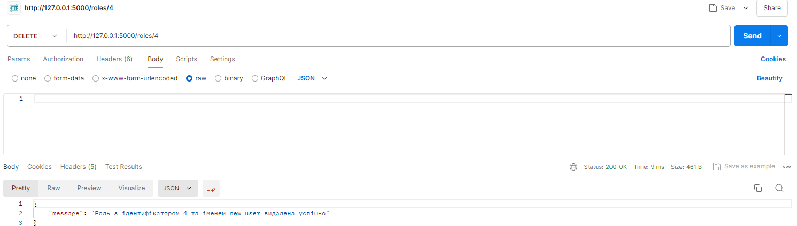
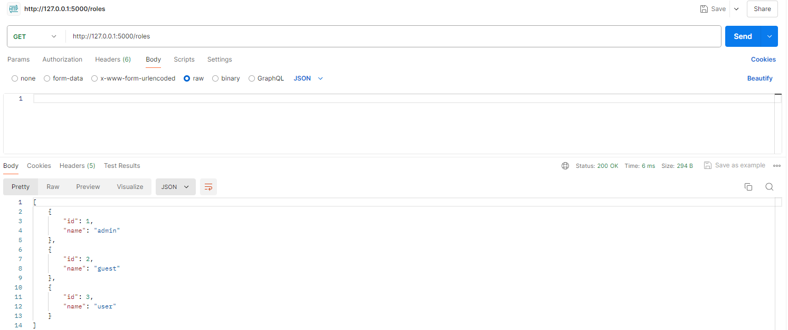

# Тестування працездатності системи

#### Тестування RESTfull сервісу з допомогою додатку Postman.

## Запуск сервера

## Метод GET

### Усі ролі
#### Вивід усіх ролей

## Метод POST

### Створення ролі
#### Успішне створення нової ролі

#### Вивід усіх ролей

### Вийняткові ситуації при створенні ролі
#### Наявність ідентифікатора та імені у вхідних даних

#### Наявність ролі з вказаним ідентифікатором

#### Наявність ролі з вказаним іменем

## Метод PUT

### Оновлення ролі
#### Успішне оновлення ролі

#### Вивід усіх ролей

### Вийняткові ситуації при оновленні ролі
#### Наявність ролі з вказаним ідентифікатором

#### Наявність імені у вхідних даних

#### Наявність ролі з вказаним іменем

## Метод DELETE

### Видалення ролі
#### Успішне видалення ролі

#### Вивід усіх ролей

### Вийняткові ситуації при видаленні ролі
#### Наявність ролі з вказаним ідентифікатором

